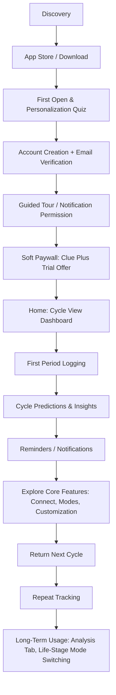

# Clue App — Current-State User Journey Analysis
### New User Perspective | UX Research Artifact

---

## Evidence Base & Methodology

This analysis is built from: Clue's own support documentation and privacy materials (helloclue.com / support.helloclue.com, publisher BioWink GmbH, Berlin), current App Store and Google Play listings, published user reviews (with visible developer responses), Wikipedia's sourced company background, and a third-party UX teardown (ScreensDesign) that reviewed a recorded onboarding session and screenshots. I did not operate a live instance of the app myself, so screen-by-screen wording and exact sequencing beyond what these sources confirm is marked accordingly.

**Tags used throughout:** **[FACT]** = confirmed by Clue's own materials or app store listings · **[OBSERVATION]** = confirmed by a third-party review of the actual product (screenshots/recorded flow) · **[INFERENCE]** = my UX interpretation, not itself verified · **UNVERIFIED / NEEDS VALIDATION** = could not be confirmed from available sources.

In the journey and emotion tables below, *System Response* and *Touchpoint* cells reflect [FACT]/[OBSERVATION]-tier evidence; *User Thought*, *Emotion*, *Friction*, and *Opportunity* cells are [INFERENCE] unless a table elsewhere in this doc grounds them in evidence.

---

## 1. Persona — New Clue User ("Maya")

**Goal:** Understand her body and reliably predict her period and cycle-related symptoms.
**Motivation:** Tired of being caught off guard, or newly curious after a doctor visit, birth-control change, or life-stage shift (first period, trying to conceive, perimenopause).
**Expectations:** A free, medically credible app that predicts periods, tracks symptoms, and explains what's normal.
**Concerns:** This is sensitive health data — is it private? Is tracking worth the effort before it's accurate? Are there hidden costs?
**Main needs:** A fast first log, a clear prediction, visible privacy reassurance, non-judgmental education.
**Success criteria:** Logs her first period within minutes of install, understands what happens to her data, sees a next-period estimate, and returns next cycle without a push notification prompting her.

---

## 2. End-to-End Journey Map

| Stage | User Goal | User Action | Touchpoint/Screen | System Response | User Thought | Emotion | Friction | Opportunity |
|---|---|---|---|---|---|---|---|---|
| Discovery | Find a trustworthy tracker | Searches store or gets a referral | App Store / Play Store listing [FACT] | Listing leads with "#1 women-led," GDPR/privacy claims, 100+ trackables [FACT] | "Is this legit and private?" | Cautiously curious | Privacy is the category's core anxiety; claims alone may not resolve it | Put concrete privacy proof (not just claims) in the listing itself |
| Download & First Open | Get in quickly | Downloads, opens app | App icon → launch | Moves directly into a personalization quiz [OBSERVATION] | "Let's get started" | Neutral, ready | No "just browsing" path before committing to data entry | Offer a lightweight explore-first option |
| Personalization Quiz | Get a tailored app | Answers cycle length, health conditions, goals (track / conceive / birth control / perimenopause) | Multi-step quiz — part of a 15-step onboarding flow [OBSERVATION] | Uses answers to tailor mode/content | "They're asking a lot, but it feels thorough" | Trust-building, mildly effortful | Long sequence; no confirmed progress indicator (UNVERIFIED) | Show progress; defer non-essential questions |
| Account Creation | Save her data | Enters email + 15-char password or Apple/Google/Facebook sign-in; verifies email | Account/Sign-up screen [FACT] | Sends verification email; data synced to EU servers [FACT] | "Why do I need an account to track a period?" | Mild resistance | Mandatory since 2019 [FACT]; must leave app to verify | Explain the "why" (device-loss protection) before asking |
| Guided Tour & Permission | Learn where things are | Taps through coachmarks; grants/declines notifications | Cycle View w/ tooltips [OBSERVATION] | Highlights key actions like logging past periods [OBSERVATION] | "This is a lot, but it's guiding me" | Slightly overwhelmed, reassured | Compounds an already-long onboarding | Time coachmarks to first real use, not all upfront |
| Soft Paywall | Get into the free app | Views Clue Plus offer: 7-day trial, testimonials, star ratings [OBSERVATION] | Paywall screen, appears near end of onboarding [OBSERVATION] | Offers subscribe or (assumed) continue free | "I just told them a lot about my body, and now there's a sales pitch" | Trust dip | Placement right after heavy self-disclosure [OBSERVATION + INFERENCE] | Move paywall to after first real value moment |
| Home / Cycle View | See where she is in her cycle | Views circular dashboard | Cycle View [FACT/OBSERVATION] | Shows cycle day, color-coded phases (period/fertile/PMS) [FACT] | "This is what I'm here for" | Engaged | Feels abstract with nothing logged yet | Prompt first log directly from the empty state |
| First Period Logging | Log her period | Taps Track/Calendar, taps day, selects flow, saves | Track / Calendar View [FACT] | Marks day(s), begins building prediction data | "That was easy" | Small satisfaction | Minimal for one day; backfilling is more effort | Surface quick-track/bulk-log for switchers early |
| Predictions & Insights | Know when her period/fertile window is coming | Checks Calendar and Analysis views over time | Calendar View, Analysis Tab [FACT] | Predicts, but full accuracy needs 3 complete cycles [FACT] | "Is this right yet?" | Cautious optimism | Low-confidence first predictions | State the 3-cycle expectation right on the prediction |
| Reminders & Notifications | Not forget to log or miss her period | Sets up reminders | More Menu → Reminders [OBSERVATION] | Configurable period/birth-control/symptom reminders [FACT] | "Good, it'll nudge me" | Reassured | Setup isn't obviously prompted (UNVERIFIED) | Prompt reminder setup right after first log |
| Explore Core Features | Get more value | Tries Connect, custom tags, discreet icon, mode switching | More Menu, Settings [FACT] | Reveals Connect (Plus, one-directional, one connection) [FACT], custom tags, discreet icon | "There's more here than I expected" | Positive discovery, mild premium-wall frustration | Best features increasingly gated | Surface a clear free-vs-Plus map early |
| Return & Long-Term Use | Build a full picture over months | Logs regularly, reads Content Tab, may switch modes across life stages | Cycle View, Analysis Tab, Content Tab [FACT] | Predictions sharpen; cycle-history report available for doctor visits [FACT] | "It actually knows my body now" | Confidence, ownership | Ongoing upsell prompts can cause fatigue | Reward consistent free logging, not just subscription asks |

---

## 3. Onboarding Deep Dive

*Grouped into the 6 meaningful clusters supportable by evidence — not all 15 discrete steps, since exact per-screen copy for each of the 15 isn't independently verifiable. Onboarding step count and general shape: **[OBSERVATION]**, ScreensDesign teardown.*

**A. Personalization Quiz (cycle length, last period, health conditions, goal)** — [OBSERVATION]
- What user sees: A sequence of question screens rather than a single "welcome" splash.
- Needs to do: Answer questions about cycle regularity, conditions, and why she's tracking (period only / trying to conceive / birth control / perimenopause).
- Info requested: Cycle/health history, personal goal.
- Why it matters: Lets Clue route her into the right mode and content later.
- Possible confusion: Health-condition questions this early, before any trust has been earned, can read as invasive.
- Possible drop-off: Users wanting "just a quick period tracker" may bail mid-quiz.
- UX observation: ScreensDesign frames this as "a masterclass in building trust through data" — but that reading assumes the user finishes it; abandonment risk isn't visible in a teardown of a completed session.

**B. Account Creation (email/password or SSO + verification)** — [FACT]
- What user sees: Sign-up screen; email + 15-character password, or Apple/Google/Facebook sign-in.
- Needs to do: Create credentials, then leave the app to click a verification link.
- Info requested: Email (and password, unless using SSO).
- CTA: "Create account."
- Why it matters: Since 2019, an account is required so tracked data is backed up on EU servers rather than living only on-device.
- Possible confusion: Users may not understand why a period tracker needs an account at all.
- Possible drop-off: The email-verification hop out of the app is a natural exit point.
- UX observation: The stated rationale (protecting against data loss) is in a support article, not in the sign-up flow itself — UNVERIFIED whether it's shown at the moment of asking.

**C. Notification Permission** — INFERENCE (existence of reminders is [FACT]; placement in onboarding is UNVERIFIED)
- Likely an OS-level permission prompt tied to setting up period/reminder notifications.
- Why it matters: Reminders are core to the retention loop.
- Possible confusion: Standard OS permission dialog, low risk.

**D. Guided Tour (coachmarks on Cycle View)** — [OBSERVATION]
- What user sees: Non-intrusive tooltips pointing at key actions like tracking past periods.
- Why it matters: Prevents new-user overwhelm on a data-dense screen.
- Possible drop-off: Comes late in an already 15-step flow, compounding fatigue.

**E. Soft Paywall (Clue Plus trial offer)** — [OBSERVATION]
- What user sees: A 7-day free trial on the annual plan, star ratings, testimonials.
- CTA: Subscribe (a free/continue path is assumed but not independently confirmed — UNVERIFIED how prominent it is).
- Why it matters: This is the monetization moment, placed after the user has already disclosed personal data and invested time.
- Possible confusion/drop-off: Feels like a pivot from "health tool" to "sales pitch" at the least convenient moment.

**F. First Entry to the Real App** — [FACT/OBSERVATION]
- Lands on Cycle View, ready for her first log.

---

## 4. First Successful Task: Period Logging

**Trigger →** She wants to know when her period will end / when the next one is due, or is switching from another app.
**Action →** Opens Track or double-taps a day in Calendar View. [FACT]
**Screen →** Finds "Period" at the top of the tracking categories. [FACT]
**Decision →** Selects flow level: Light, Medium, Heavy, or Super Heavy. [FACT]
**System Response →** Marks the day; Clue infers period start/end from the first and last day a flow level is logged. [FACT]
**Completion →** Taps Save. [FACT]
**Next Step →** Repeat for remaining period days, or use Quick Track to bulk-log flow across multiple past days at once (useful when switching apps). [FACT]

- **Was the task easy?** Yes, once reached — a single tap-select-save loop.
- **Was the next step obvious?** Reasonably — Save and the calendar view visually confirm the entry, but nothing observed explicitly nudges her toward the next action (e.g., "set a reminder now").
- **What could confuse a new user?** Whether to log light spotting as "Period" at all; the difference between Track and Calendar View entry points isn't obviously signposted for first-timers.
- **What creates confidence?** The visible, color-coded result on the calendar immediately after saving.
- **What creates friction?** The task itself is easy — the friction is everything *before* it (15-step onboarding, account creation, paywall) that delays reaching it.

---

## 5. Core Experience — Feature Snapshot

- **Period tracking:** Log flow via Track/Calendar; free tier included. [FACT]
- **Cycle predictions:** Free tier predicts; full accuracy needs 3 complete cycles logged; Clue Plus adds predictions up to 12 months ahead. [FACT]
- **Symptom tracking:** 100+ trackable experiences free; Clue Plus adds ~10 more categories (sleep quality, urine, vulva & vagina, supplements) and unlimited custom tags. [FACT]
- **Calendar:** Cycle View (circular, phase-based) and Calendar View (month grid) are distinct screens. [FACT]
- **Insights:** Analysis Tab shows cycle-history stats; extra depth is Clue Plus. [FACT]
- **Education:** Content Tab has expert-written articles (hundreds); free tier has partial access, full access is Clue Plus. [FACT]
- **Notifications:** Configurable period, birth-control, and symptom reminders under the Reminders menu. [FACT]
- **Personalization:** Mode switching (Period Tracking, Conceive, Pregnancy, Perimenopause, tracking without a period); custom app icon and discreet/hidden-app options. [FACT]
- **Privacy:** GDPR-governed, EU-hosted, opt-in-only marketing/analytics tracking, PIN/password app lock. [FACT]
- **Subscription (Clue Plus):** Monthly or yearly, roughly **$9.99/mo or $39.99/yr in the US** — pricing varies by region and is shown in-app, not in the store listing (**figures are third-party-reported/approximate — treat exact numbers as UNVERIFIED / NEEDS VALIDATION**, though the region-variable, in-app-only pricing model itself is [FACT]).

---

## 6. Emotional Journey

| Stage | Expected Emotion | Likely Emotion | Why | UX Impact |
|---|---|---|---|---|
| Discovery | Hopeful | Cautious/skeptical | Health-data privacy is this category's default worry | Privacy signals need to be visible before install, not buried in policy |
| Personalization quiz | Understood, cared for | Understood but fatigued | 15-step flow before any payoff [OBSERVATION] | Risk of quiz fatigue before product value is shown |
| Account creation | Reassured, data is safe | Mildly annoyed | Mandatory step, requires an app-switch to verify email [FACT] | Friction lands right before her first "win" |
| Soft paywall | Making an informed choice | Mistrust / bait-and-switch feeling | Appears right after disclosing personal/health data [OBSERVATION] | Single biggest trust-risk moment in the journey |
| First period log | Accomplishment | Genuine small satisfaction | Task itself is simple once reached [FACT] | This moment should arrive sooner in the flow |
| Early predictions (pre-3-cycle) | Confidence | Uncertainty | Clue itself states 3 full cycles are needed for accuracy [FACT] | Needs explicit expectation-setting copy at the prediction |
| Later paywalled content/features | Discovery | Mild frustration, especially for lapsed subscribers | Confirmed in reviews and Clue's own developer responses [FACT] | Risk of negative reviews and churn |
| Long-term pattern recognition | Empowerment | Genuine empowerment | Aligns with stated mission and testimonials on Clue's own site [FACT] | Strongest loyalty driver — worth reinforcing earlier |

---

## 7. Pain Points (Ranked)

| Rank | Pain Point | Stage | User Impact | Severity | Evidence/Reason |
|---|---|---|---|---|---|
| 1 | Soft paywall appears immediately after a data-heavy personal/health quiz | Onboarding | Feels like a bait-and-switch right when trust is most fragile | High | ScreensDesign teardown: paywall shown "after the user has already invested time and personal data" [OBSERVATION] |
| 2 | Aggressive re-subscribe prompting after a lapsed Clue Plus subscription | Retention | Drives away former paying users; explicitly named "frustrating and unusable" | High | Google Play review (2025) + Clue's own developer response acknowledging it [FACT] |
| 3 | 15-step onboarding before reaching the core app | Onboarding | Drop-off risk for impatient or "just want a tracker" users | High | ScreensDesign: 15 onboarding steps, explicitly flagged as a weakness [OBSERVATION] |
| 4 | Previously-free educational content increasingly gated behind Clue Plus | Insights/Education | Erodes goodwill among long-time free users | Medium | App Store review + developer response confirming shift toward Plus [FACT] |
| 5 | Mandatory account creation + email verification before first real use | Account/Sign-up | Delays first task; exits the app mid-flow | Medium-High | Clue Support: account required since 2019, verification email required [FACT] |
| 6 | Predictions need 3 full cycles before they're reliable | Predictions | Low-confidence, "empty" early payoff | Medium | Clue Support: "Clue only needs three complete cycles to start giving accurate predictions" [FACT] |
| 7 | Granular tracking screen (100–200+ categories) can overwhelm new users | First logging | Choice overload despite customization options | Medium | ScreensDesign teardown + Play Store listing (100+/200+ trackables) [FACT/OBSERVATION] |
| 8 | No dedicated flow for logging a major event like giving birth | Symptom/period logging | Forces a manual workaround (hiding a cycle in Analysis) for a significant life moment | Medium | App Store developer response (Feb 2025) addressing this reported gap directly [FACT] |
| 9 | Clue Plus price shown only in-app, varies by region, not stated in store listing | Discovery/Paywall | Reduces pre-purchase transparency | Low-Medium | Clue Support: "price varies... check the subscription screen in your app" [FACT] |
| 10 | Clue Connect is one-directional and limited to one connection at a time | Core feature exploration | Limits usefulness for mutual-sharing or multi-person (e.g., care team) scenarios | Low-Medium | Clue Support: Connect feature description [FACT] |

---

## 8. Moments of Delight

1. **In-app "Learn more" links on tracked items and cycle phases** — Why it works: turns a moment of curiosity into an immediate, credible answer without leaving the flow. [OBSERVATION] User benefit: no need to search elsewhere for trustworthy info. Emotional impact: reassurance.
2. **Discreet app presentation (custom icon, hideable app, PIN lock)** — Why it works: privacy-by-design for situations where a phone might be seen by someone else. [FACT] User benefit: control over disclosure. Emotional impact: safety.
3. **Circular Cycle View with color-coded phases and guided coachmarks** — Why it works: makes cycle biology legible at a glance without a wall of numbers. [OBSERVATION] User benefit: fast orientation. Emotional impact: clarity, confidence.
4. **Clue Connect for sharing basic cycle info with a partner or friend** — Why it works: turns a sometimes-taboo topic into an easy, low-stakes conversation, with strict limits on what's shared (no moods, symptoms, or sexual activity). [FACT] User benefit: social support without full exposure. Emotional impact: connection, reduced stigma.
5. **Explicit, repeated privacy commitments** (GDPR governance, "never sell data," a stated refusal to comply with data subpoenas) — Why it works: directly answers the single biggest fear for this data category. [FACT] User benefit: reduced anxiety about a sensitive app category. Emotional impact: trust, relief.

---

## 9. Trust & Privacy

- **Privacy communication:** Clue leads with privacy in its store listings and website ("privacy-first," GDPR-governed, EU-headquartered). [FACT]
- **Data collection:** Cycle dates, flow, 100–200+ optional symptom/experience categories, birth control method, health conditions (all self-disclosed, not device-sensed). [FACT]
- **Permission requests:** Notification permission for reminders (existence [FACT]; exact onboarding placement UNVERIFIED); iOS activity-tracking permission is separately opt-in for advertising purposes. [FACT]
- **User control:** Granular privacy settings toggle marketing/analytics use; account and data can be managed or deleted; app can be hidden/PIN-locked. [FACT]
- **Trust signals:** Co-CEO statements commit to never disclosing pregnancy/abortion-related health data to any authority, and to non-compliance with data subpoenas. [FACT] — This is a stated commitment, not a legal guarantee; I make no claim about its enforceability.
- **Transparency:** Clue Plus price is only shown once a user is deep in the app (post-quiz), not on the store listing — a legitimate transparency gap even though the reason (regional pricing) is understandable. [FACT + INFERENCE]
- **A tension worth naming:** the sequence of "disclose sensitive health data first, see a subscription pitch second" is a real design choice, not just user perception — visible in the onboarding teardown itself. [OBSERVATION] Whether this is *intentional* leverage or simply a monetization-funnel default is UNVERIFIED / NEEDS VALIDATION; I'm not asserting intent, only describing the sequence and its likely emotional effect.

---

## 10. Retention Journey

**New User → First Successful Task → First Useful Result → Repeat Usage → Habit → Long-Term User**

- **New User → First Task:** Reached only after quiz, account creation, tour, and paywall — a long runway before the simple act of logging a period. [OBSERVATION-informed]
- **First Task → First Useful Result:** Delayed relative to most habit apps — Clue's own guidance says accuracy needs 3 full cycles, so the "useful result" (a trustworthy prediction) doesn't arrive in session one. [FACT]
- **Repeat Usage:** Driven mainly by reminders (period, birth control, symptom) and natural cycle timing (checking before an event). [FACT-supported]
- **Habit:** Reinforced by the Cycle View becoming a routine check-in and by Content Tab education building a sense of being informed. [FACT]
- **Long-Term User:** Reinforced by the Analysis Tab's pattern recognition (useful for doctor conversations, per user testimonials on Clue's own site) and by mode-switching that keeps the same app relevant across life stages — first period through perimenopause. [FACT]

**Major reasons a user might return:** reminders; curiosity about whether a prediction held; wanting to log same-day symptoms; checking an upcoming period before travel/events; educational content; preparing a cycle-history report for a doctor.

**Major reasons a user might leave:** paywall fatigue, especially post-cancellation nagging [FACT, per reviews]; feeling the "real" insights are gated; unreliable early predictions during the 3-cycle ramp-up; the sheer length/density of onboarding causing early abandonment before habit forms; general privacy caution around sensitive health apps, which Clue's own reassurance messaging suggests it takes seriously enough to address head-on. [FACT + INFERENCE]

---

## 11. User Flow

---

## 12. UX Opportunities

| Priority | Current Problem | User Need | Opportunity | Expected Impact |
|---|---|---|---|---|
| 1 | Paywall lands right after the data-heavy quiz | Feel value before being asked to pay | Move/soften paywall placement; make the free path equally visible | Less bait-and-switch feeling, higher onboarding completion |
| 2 | Aggressive re-subscribe prompts after a lapse | Use the free tier without constant interruption | Cap prompt frequency to one passive dashboard reminder | Fewer churn-driven negative reviews |
| 3 | 15-step onboarding before first real use | Get to first log quickly | Offer a "log now, personalize later" quick-start path | Faster time-to-first-value, fewer drop-offs |
| 4 | Mandatory account + email verification before use | Try the app immediately | Allow a limited local trial before requiring a verified account | Lower first-session abandonment |
| 5 | Predictions feel empty for the first 3 cycles | An early signal of value | Make the existing quick-track/backfill feature prominent during onboarding | Faster perceived accuracy, stronger week-one retention |
| 6 | Previously-free content now paywalled | Trust that the free tier stays genuinely useful | Clearly label a permanent free-content baseline | Preserves goodwill among long-tenured free users |
| 7 | Tracking screen has 100–200+ categories | Not feel overwhelmed on day one | Smarter starter category set with progressive disclosure | Less choice paralysis, higher first-log completion |
| 8 | Clue Plus price hidden until deep in-app | Know the cost before investing time | Surface regional price earlier (listing or early screen) | Fewer surprise-driven drop-offs at the paywall |
| 9 | Clue Connect is one-directional, single-connection | Flexible sharing (multiple people, mutual view) | Expand the sharing model | Broader use in co-parenting/care-team contexts |
| 10 | Gaps for major life events (e.g., giving birth) | A tracking model that adapts to real milestones | Add explicit event-logging beyond the period/symptom taxonomy | Fewer support tickets, better long-term data continuity |

---

## 13. Final Summary

### 5 Biggest Strengths
1. In-context education ("Learn more" links) built directly into tracking screens.
2. Strong, explicit, repeatedly stated privacy commitments (GDPR, EU hosting, subpoena-resistance).
3. Privacy-by-design controls: discreet app icon, hideable app, PIN lock.
4. A clear, visual, color-coded Cycle View that makes cycle biology legible fast.
5. Clue Connect enables low-stigma sharing with tight, well-scoped data limits.

### 5 Biggest Frictions
1. Soft paywall placed immediately after a personal, health-detailed quiz.
2. A 15-step onboarding sequence before reaching the core app.
3. Mandatory account creation with an email-verification detour.
4. Predictions need 3 full cycles before they're trustworthy — a slow first payoff.
5. Aggressive re-subscribe prompting for lapsed Clue Plus users.

### 5 Most Important Moments
1. The personalization quiz (trust-building or trust-fatiguing, depending on execution).
2. Account creation (the first real "why do I need this" friction point).
3. The soft paywall (the single highest-stakes trust moment in the journey).
4. The first period log (simple, satisfying — but arrives late).
5. The first prediction (where expectation-setting about accuracy matters most).

### 5 Highest-Priority Opportunities
1. Reposition the paywall away from the moment of maximum personal disclosure.
2. Shorten or restructure onboarding around a "log first, personalize later" path.
3. Cap post-lapse subscription prompting.
4. Set explicit accuracy expectations at the first prediction.
5. Make the free tier's permanent value clearer and more stable over time.

### Overall UX Assessment
Clue's core tracking loop — open, tap a day, select a flow level, save — is genuinely simple and well-executed once a new user reaches it. The friction in this journey isn't in the core task; it's in everything placed *before* it: a long, quiz-heavy onboarding, a mandatory account with an email-verification detour, and a monetization pitch that lands right after the user has shared sensitive personal health information. Clue's strongest asset — its credible, privacy-forward positioning — is somewhat undercut by that sequencing, and by post-cancellation subscription prompting that shows up clearly in user reviews. The opportunity isn't a redesign of what Clue does; it's resequencing *when* it asks for data, an account, and money relative to when it delivers the user's first real win.

---

## Sources Consulted
Clue Support (support.helloclue.com) · helloclue.com (privacy, Clue Plus, how-to articles) · Apple App Store & Google Play listings for Clue Period & Cycle Tracker (BioWink GmbH) · Wikipedia, "Clue (mobile app)" · ScreensDesign UX teardown of Clue's onboarding · App Store / Google Play user reviews with visible Clue developer responses · The Lowdown and third-party blog coverage of Clue Plus pricing (approximate figures only).

*Note: several unrelated products share the "Clue" name (a UK facilities-management tool, a fleet-management SaaS, an AI meeting assistant called "Cluely," and Cluedo-branded mystery games). None of those were used as sources here.*
